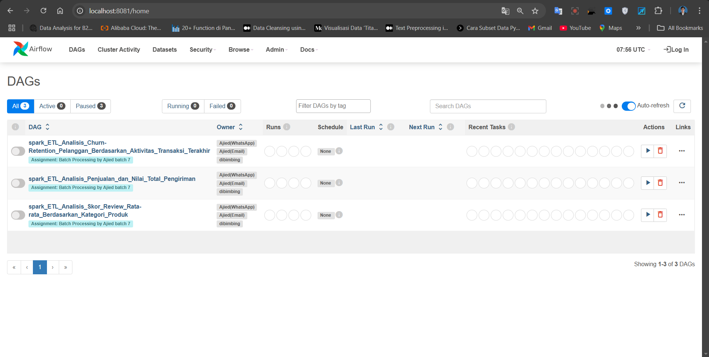
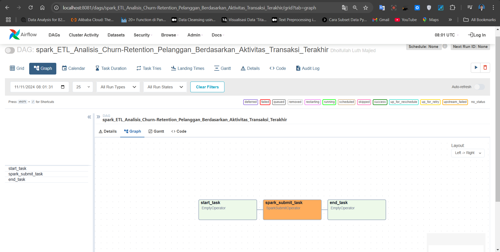
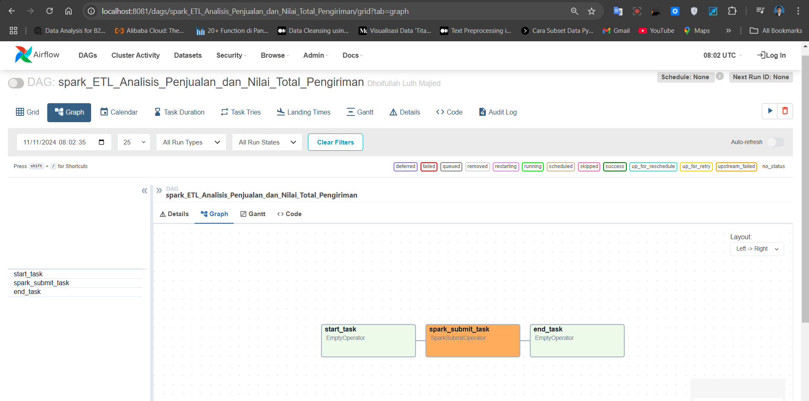
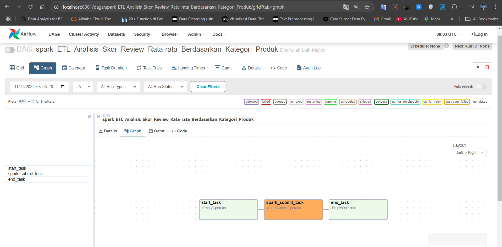
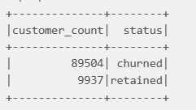
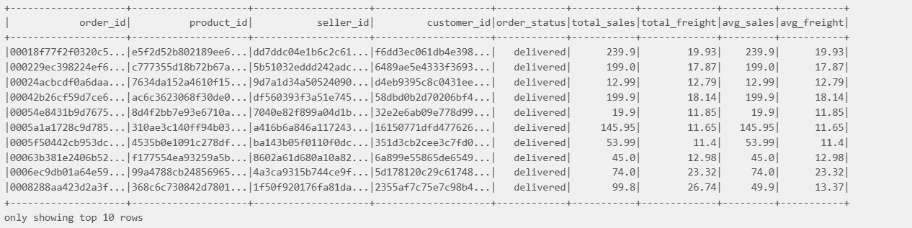
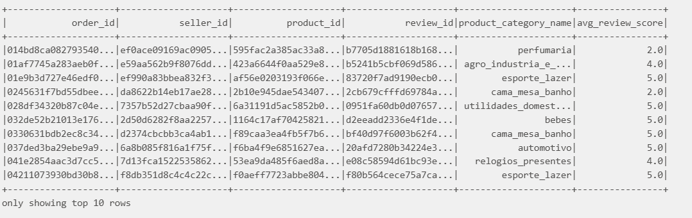
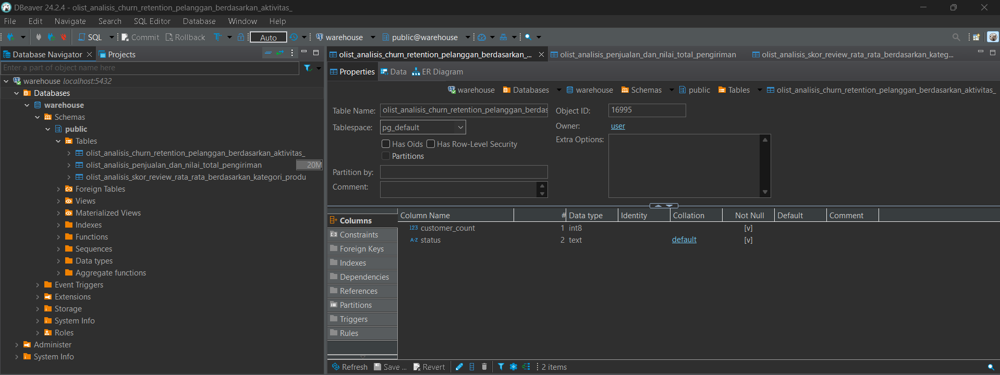

# Dibimbing-Ajied, Data Engineering Bootcamp

# Batch Processing

<div style="text-align: center;">
  
</div>

# Run

1. Clone This Repo.
2. Run `make docker-build`, Run `make spark`, Run `make jupyter`, Run `make postgres` & Run `make airflow`    

list code
---
```
## docker-build                 - Build Docker Images (amd64) including its inter-container network.
## postgres                     - Run a Postgres container
## spark                        - Run a Spark cluster, rebuild the postgres container, then create the destination tables
## jupyter                      - Spinup jupyter notebook for testing and validation purposes.
## airflow                      - Spinup airflow scheduler and webserver.
## postgres-sql                 - Run psql in Postgres container
```

---

# Dokumentasi

- UI airflow
<div style="text-align: center;">
    
</div>

- DAG Analisis_Churn-Retention_Pelanggan_Berdasarkan_Aktivitas_Transaksi_Terakhir
<div style="text-align: center;">
    
</div>

- DAG Analisis_Penjualan_dan_Nilai_Total_Pengiriman
<div style="text-align: center;">
    
</div>

- DAG Analisis_Skor_Review_Rata-rata_Berdasarkan_Kategori_Produk
<div style="text-align: center;">
    
</div>

- output table Analisis_Churn-Retention_Pelanggan_Berdasarkan_Aktivitas_Transaksi_Terakhir di database postgres
<div style="text-align: center;">
    
</div>

- output table Analisis_Penjualan_dan_Nilai_Total_Pengiriman di database postgres
<div style="text-align: center;">
    
</div>

- output table Analisis_Skor_Review_Rata-rata_Berdasarkan_Kategori_Produk di database postgres
<div style="text-align: center;">
    
</div>

- data masuk ke database postgresql dengan database bernama 'warehouse'
<div style="text-align: center;">
    


* Bila terjadi error saat build dan menjalankan beberapa container disarankan menjalankan ini:

1. Run perintah ini dan pastikan semua container dalam keadaan stop atau tidak menyala
```
git config --global core.autocrlf input
```

2. Atur ulang repo menggunakan ini (jangan lupa simpan perubahan Anda):
```
git rm --cached -r .
git reset --hard
```
3. Kemudian Run kembali container ya...
